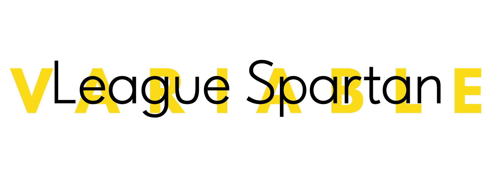

**Please note:** This typeface has many structural issues and probably needs to be rebuilt from the ground up, by someone with more type design knowledge than myself. You have been warned.

*– Fredrik Hemsen, 23.08.2018*

League Spartan Variable
=============
_by [Micah Rich](http://micahrich.com), [Caroline Hadilaksono](http://www.hadilaksono.com), and [Tyler Finck](http://www.tylerfinck.com)_

**A new classic, this is a modern, geometric sans-serif that has no problem kicking its enemies in the chest.**

Taking a strong influence from ATF's classic Spartan family. We've put a few unique touches into a beautiful, historical typeface, and made sure to include an extensive character set – currently totalling over 300 glyphs. As of June 2018, it has been converted into a variable font with 5 pre-defined weights.

- - -

_In addition, the incredible [Philip von Borries](http://www.vaubee.com) has crafted a beautiful and detailed animated version of League Spartan to accompany the release – partnering with [Animography.net](http://animography.net/products/league-spartan) to expand on it and sell it._

_It's simple and beautiful, and makes some extremely complex, very compelling typographic animations quickly._

_And part of the profits are going right back into supporting The League and making more great stuff, so if you love it, [grab a license today](http://animography.net/products/league-spartan)._
